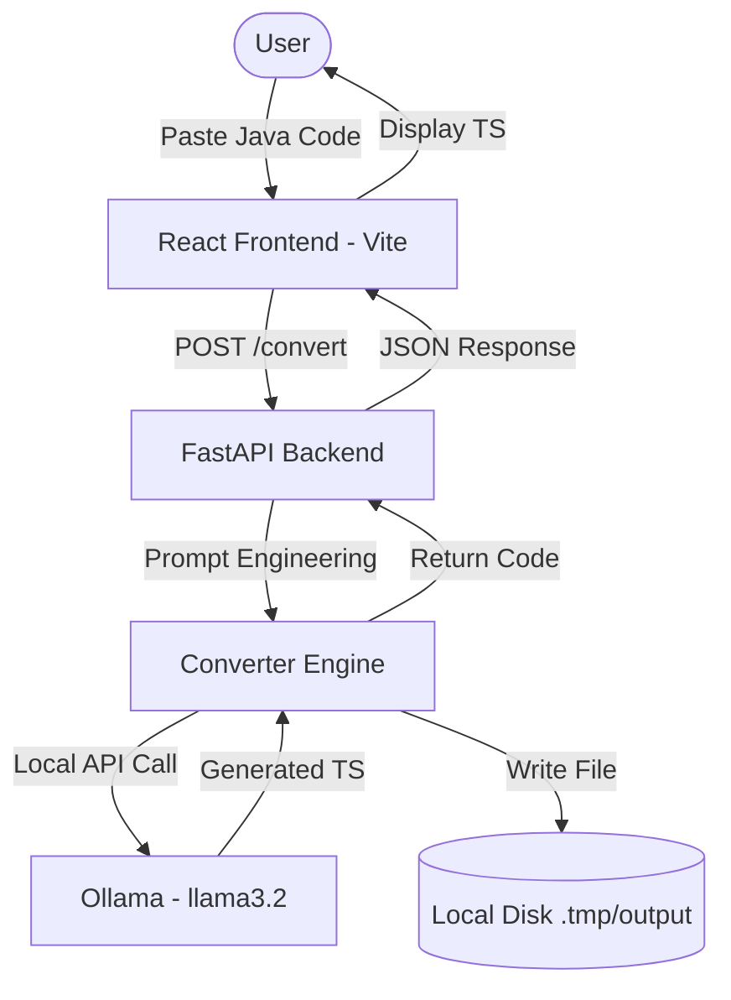

# 🚀 B.L.A.S.T. Selenium to Playwright Converter

A premium, localized tool to convert legacy **Selenium Java (TestNG)** test scripts into modern **Playwright TypeScript** using Local Large Language Models (LLMs) via Ollama.

## 🏗️ Architecture



## ✨ Features

-   **Privacy First:** No data leaves your machine. Uses **Ollama** and **llama3.2** locally.
-   **Intelligent Mapping:** Converts TestNG annotations (`@Test`, `@BeforeMethod`) to Playwright test hooks.
-   **Premium UI:** Modern dark-mode dashboard with real-time conversion logging.
-   **Readability Prioritized:** Generates idiomatic TypeScript instead of 1:1 line-mapping.
-   **Auto-Save:** Converted scripts are automatically saved to your local directory.

## 🛠️ Tech Stack

-   **Frontend:** React 18, Vite, TypeScript, Lucide Icons, Vanilla CSS (Glassmorphism).
-   **Backend:** Python 3.10+, FastAPI, Uvicorn.
-   **AI:** Ollama API (`llama3.2:latest`).

## 🚀 Quick Start

### 1. Prerequisites
- [Ollama](https://ollama.com/) installed and running.
- Python 3.10+ and Node.js 18+ installed.

### 2. Prepare the Model
```bash
ollama pull llama3.2
```

### 3. Start the Backend
```bash
# From the project root
python backend/main.py
```

### 4. Start the Frontend
```bash
cd frontend
npm install
npm run dev
```

### 5. Convert
Open [http://localhost:5173](http://localhost:5173) in your browser.

## 📂 Project Structure
- `architecture/`: Logic mapping and System SOPs.
- `tools/`: Core conversion engine and LLM integration.
- `backend/`: FastAPI server implementation.
- `frontend/`: React/Vite source code.

---
Built with the **B.L.A.S.T.** Protocol (Blueprint, Link, Architect, Stylize, Trigger).
